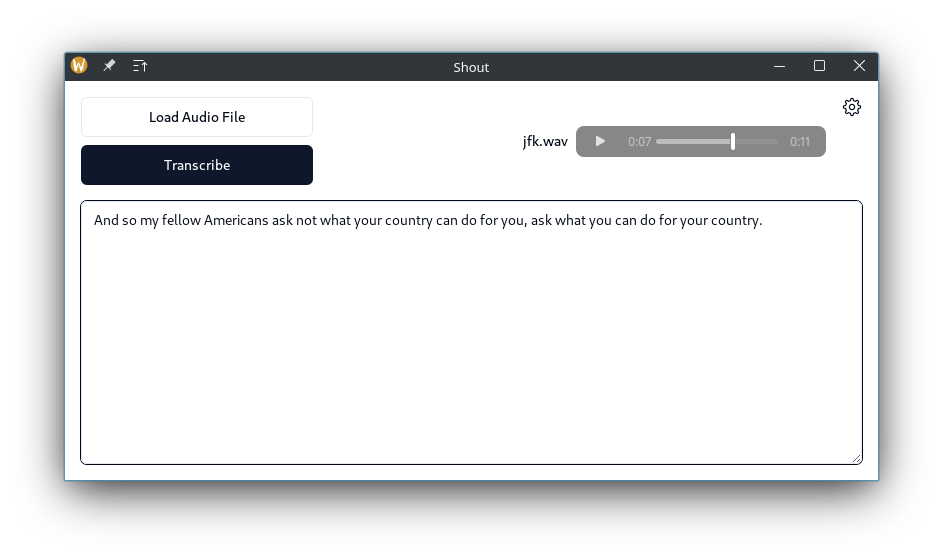

# WhisperGo 

WhisperGo is an automatic speech recognition (ASR) application that transcribes audio files to text. It is powered by whisper.cpp, a C++ implementation of OpenAI's Whisper model. The application is built in Go and Svelte using Wails.

This project showcases the efficiency of the Whisper model, which is capable of transcribing audio files in real-time. The model is lightweight and can be run on a CPU, and larger versions of it can also be executed on a GPU.

## Features

- Efficient, real-time transcription of audio files.
- Optional support for GPU acceleration.
- Support for multiple Whisper models, varying in size and accuracy.
- Clean and easy-to-use interface.

<br />



## Prerequisites

- Go 1.20+
- Node.js 15+ and pnpm
- Wails 2.8+ and its dependencies
- GCC 12+, make and wget
- (Optional) CUDA 12.0+ for GPU acceleration

## Building

Clone the repository and navigate to the project directory:

```bash
git clone https://github.com/GarciaLnk/whispergo
cd whispergo
git submodule update --init --recursive
```

Build the project:

```bash
make
```

Run the application:

```bash
./build/bin/whispergo
```
